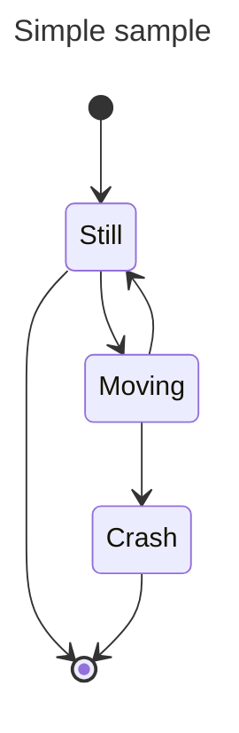
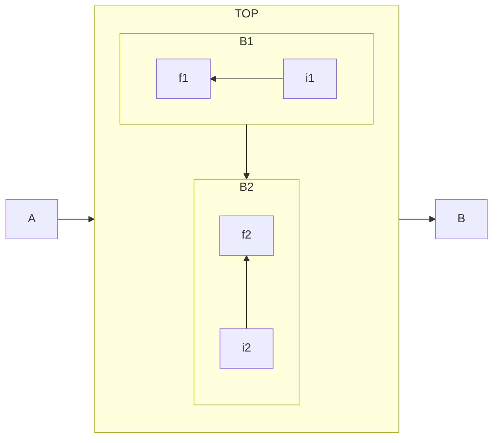
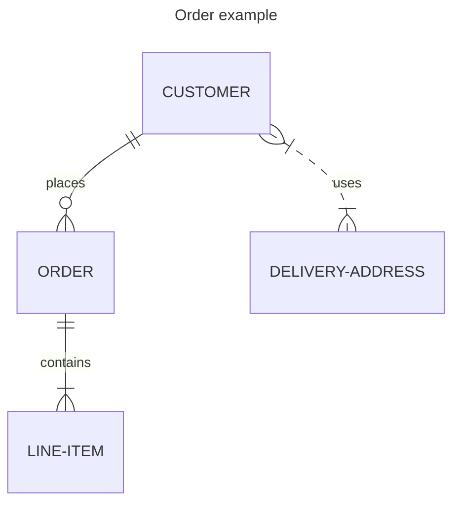
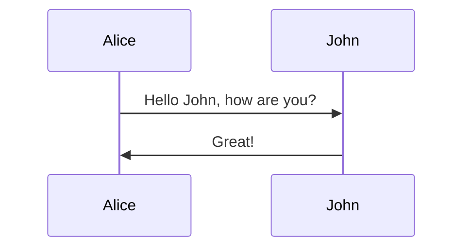
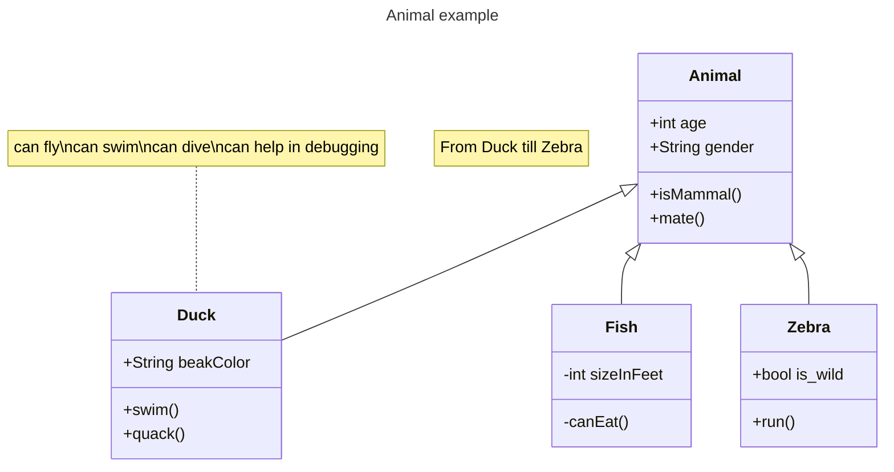

# Diagrams

See the [Mermaid Documentation](https://mermaid.js.org/syntax/flowchart.html) for more examples.

## Graph
````markdown

````


## State
````markdown

````


## FlowChart

````markdown

````


## Entity Relationship

````markdown

````


## Sequence
````markdown

````


### Class 

````markdown

````

